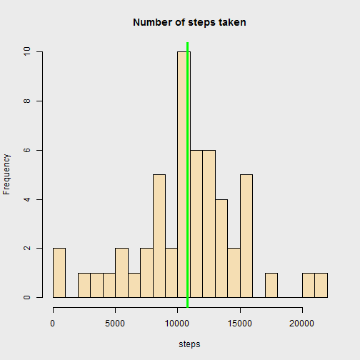
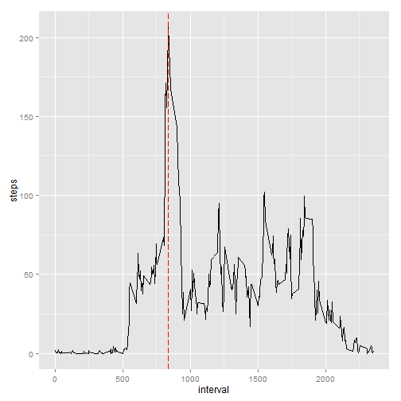
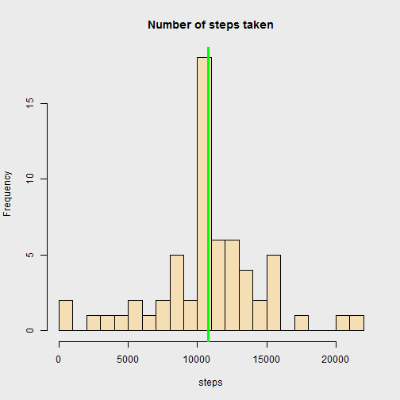

# Reproducible Research: Peer Assessment 1

*by frog*

## Loading and preprocessing the data

```r
activity<-read.csv("activity.csv",header=TRUE)
activity$date<-as.Date(activity$date)
```


## What is mean total number of steps taken per day?


```r
par(bg = "gray92")
steps<-aggregate(steps~date,data=activity,FUN=sum)
hist(steps$steps,main="Number of steps taken",xlab="steps",col="wheat",breaks=20)
abline(v=mean(steps$steps),lwd=3,col="green")
```

 

The **mean** total number of steps taken per day is: 1.0766 &times; 10<sup>4</sup>

The **median** total number of steps taken each day is: 10765


```r
summary(steps)
```

```
##       date                steps      
##  Min.   :2012-10-02   Min.   :   41  
##  1st Qu.:2012-10-16   1st Qu.: 8841  
##  Median :2012-10-29   Median :10765  
##  Mean   :2012-10-30   Mean   :10766  
##  3rd Qu.:2012-11-16   3rd Qu.:13294  
##  Max.   :2012-11-29   Max.   :21194
```

## What is the average daily activity pattern?


```r
interval<-aggregate(steps~interval,data=activity,FUN=mean)
library(ggplot2)
g<-ggplot(interval,aes(interval,steps))
p<-g+geom_line()+geom_vline(xintercept=interval[interval$steps==max(interval$steps),1],colour="red",linetype="longdash")
print(p)
```

 

The interval with the maximum number of steps is 835 with 206.1698 steps.


```r
interval[interval$steps==max(interval$steps),1]
```

```
## [1] 835
```

```r
max(interval$steps)
```

```
## [1] 206.2
```


## Imputing missing values

The dataset contains 2304 records with missing values.


```r
sum(is.na(activity$steps))
```

```
## [1] 2304
```

**Strategy to replace missing values**

The missing values are replaced with the mean value for steps according to the interval of the missing value.


```r
for (i in 1:nrow(activity)) {
    if (is.na(activity[i,1])) {
        activity[i,1]<-interval[interval$interval==activity[i,3],2]
    }
}
```

We check that there are no more missing values in the dataset


```r
sum(is.na(activity$steps))
```

```
## [1] 0
```

Histogram for number of steps taken with the completed dataset


```r
par(bg = "gray92")
steps<-aggregate(steps~date,data=activity,FUN=sum)
hist(steps$steps,main="Number of steps taken",xlab="steps",col="wheat",breaks=20)
abline(v=mean(steps$steps),lwd=3,col="green")
```

 

The **mean** total number of steps taken per day is: 1.0766 &times; 10<sup>4</sup>

The **median** total number of steps taken each day is: 1.0766 &times; 10<sup>4</sup>


```r
summary(steps)
```

```
##       date                steps      
##  Min.   :2012-10-01   Min.   :   41  
##  1st Qu.:2012-10-16   1st Qu.: 9819  
##  Median :2012-10-31   Median :10766  
##  Mean   :2012-10-31   Mean   :10766  
##  3rd Qu.:2012-11-15   3rd Qu.:12811  
##  Max.   :2012-11-30   Max.   :21194
```

## Are there differences in activity patterns between weekdays and weekends?

Create a new factor variable in the dataset with two levels - "weekday" and "weekend" indicating whether a given date is a weekday or weekend day.


```r
activity$daytype<-"weekday"
activity$daytype[weekdays(activity$date)=="Saturday" | weekdays(activity$date)=="Sunday"]<-"weekend"
activity$daytype<-as.factor(activity$daytype)
```

Make a panel plot containing a time series plot (i.e. type = "l") of the 5-minute interval (x-axis) and the average number of steps taken, averaged across all weekday days or weekend days (y-axis). The plot should look something like the following, which was creating using simulated data:


```r
interval<-aggregate(steps~interval+daytype,data=activity,FUN=mean)
library(ggplot2)
g<-ggplot(interval,aes(interval,steps)) + facet_grid(daytype~.)
p<-g+geom_line()
print(p)
```

 

